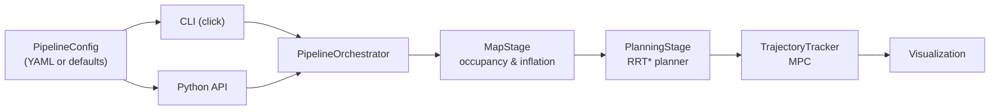

# RRT* MPC Motion Planning Framework

A modular Python framework integrating deterministic RRT* for global path planning with a curvature-aware Model Predictive Controller (MPC) for precise vehicle tracking. Initially developed as an academic prototype, the project has been restructured into a maintainable and testable architecture featuring well-defined interfaces, comprehensive documentation, and automated test coverage. It serves as a foundation for research and prototyping in autonomous motion planning rather than a production-grade implementation.

<p align="center">
  
</p>

## Key capabilities

- **Deterministic RRT\*** planner with configurable sampling, rewiring, and goal bias
  to guarantee reproducible global paths.
- **Bicycle-model MPC** tracker that enforces steering, rate, and velocity limits while
  remaining numerically well-conditioned through an OSQP backend.
- **Pipeline orchestrator** that composes map preparation, planning, and control stages
  into reusable building blocks for scripts, services, or notebooks.
- **Headless-friendly visualisation** utilities for generating artefacts and recording
  simulations without a display.
- **Extensive documentation** including developer guides, architecture notes, and
  theory references for MPC tuning and vehicle dynamics.
- **Centralised artefact handling** that writes every map, plot, and animation into
  the version-controlled `plots/` directory for easy inspection.

All generated images (inflated maps, RRT* trees, MPC prediction frames, and GIFs) are
materialised beneath `plots/`, keeping the repository tidy and outputs reproducible.

## Architecture at a glance



The `PipelineOrchestrator` produces immutable artefacts describing each stage. They can
be reused to visualise the tree, analyse trajectories, or feed downstream components.
A deeper architectural discussion lives in [`docs/architecture.md`](docs/architecture.md).

## Repository layout

```
src/
├── common/           # Geometry helpers and array typing utilities
├── config.py         # Dataclasses + YAML loader for pipeline configuration
├── pipeline/         # Map, planning, and control stages with orchestrator + API
├── planning/         # Deterministic RRT* implementation and data structures
├── control/          # MPC dynamics, linearisation, and solver wrappers
├── maps/             # Occupancy grid generators and inflation helpers
├── viz/              # Matplotlib-based plotting utilities
└── cli.py            # Click-powered command line entry points
```

Additional documentation resides in [`docs/`](docs/index.md) and runnable examples in
[`examples/`](examples/).

## Installation

```bash
python -m venv .venv
source .venv/bin/activate
pip install --upgrade pip
pip install -e .[dev]
```

The optional `[dev]` extras install testing, linting, and formatting tooling.

## Command line usage

All workflows are exposed via the Click-based CLI:

```bash
# Generate the base occupancy grid according to the configuration
python -m src.cli generate-map

# Inflate the map and persist the result
python -m src.cli inflate-map

# Run deterministic RRT* planning and visualise the tree
python -m src.cli plan-path

# Execute the full pipeline with MPC tracking and visualisation
python -m src.cli run

# Produce a GIF of the recorded simulation frames
python -m src.cli generate-gif
```

Pass `--config path/to/config.yaml` to override the defaults from `PipelineConfig`.
For headless environments set `viz.backend` to `Agg` in the configuration file.

## Output artefacts

The repository ships with a tracked `plots/` directory (ignored except for
`.gitignore`) where every command stores its outputs:

- `plots/maps/` – base and inflated occupancy grids.
- `plots/planner/` – RRT* tree snapshots from CLI commands and orchestrator runs.
- `plots/frames/` – intermediate MPC prediction frames when recording is enabled.
- `plots/animations/` – GIFs composed from recorded frames via `generate-gif` or
  [`examples/generate_simulation_gif.py`](examples/generate_simulation_gif.py).

The helper script `examples/generate_simulation_gif.py` mirrors the CLI command and
demonstrates programmatic GIF assembly using the public API.

## Programmatic API

Use the high-level helper for scripts or notebooks:

```python
from src import PipelineConfig, load_config, run_pipeline

config = load_config("configs/pipeline.yaml")
plan_result, tracked_states = run_pipeline(config, visualize=False)
print(f"Reached goal with {len(plan_result.path)} path points")
```

For granular control import the individual stages from `src.pipeline` and compose them
manually (see [`examples/run_pipeline.py`](examples/run_pipeline.py)).

## Testing

Run the automated test suite with:

```bash
pytest
```

The tests validate stage interfaces, pipeline orchestration, and configuration
loading. Continuous integration can extend this with linting and static analysis.

## Roadmap & Enhancement Ideas

- **Closed-loop replanning** – integrate a lightweight trigger that re-runs the
  planner whenever the MPC deviates beyond a tolerance, enabling operation in
  slowly changing environments.
- **Dynamic obstacle modelling** – extend the map stage to ingest time-varying
  occupancy (e.g. from ROS2 topics) and feed predictions into the MPC cost
  function for proactive collision avoidance.
- **Controller modularity** – expose a plug-in interface for alternative
  trackers (LQR, learning-based) while reusing the existing `PipelineResult`
  contract for logging and evaluation.
- **Scenario regression suite** – add parametrised tests and benchmark maps that
  validate planner success rates, solve times, and control smoothness across a
  curated set of environments.
- **Deployment hooks** – package the pipeline behind a REST/ROS2 boundary with
  structured logging and telemetry export so experiments can scale to multi-robot
  fleets.

## Further reading

- [`docs/developer_guide.md`](docs/developer_guide.md) – conventions, architecture
  decisions, and extension guidelines.
- [`docs/usage_pipeline.md`](docs/usage_pipeline.md) – step-by-step tutorial for
  configuring and running the full stack.
- [`docs/architecture.md`](docs/architecture.md) – detailed diagrams and data flow.
