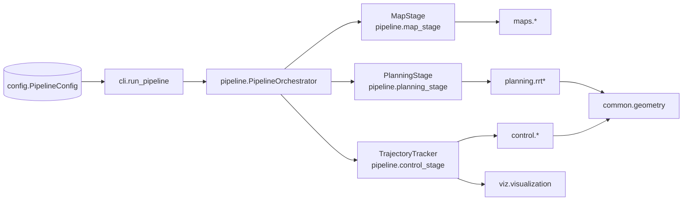

# Software Architecture

The refactored prototype is structured around composable stages so that map
preparation, path planning, and trajectory tracking can evolve independently.
The following diagram summarises the runtime composition.

## Module Responsibilities

### `pipeline`

- **map_stage.py** – encapsulates map generation, inflation and start/goal
  derivation, returning immutable `MapArtifacts` that also capture workspace
  bounds and optional rectangular obstacles for sampling-based planners.
- **planning_stage.py** – wraps planner selection (`RRTStarPlanner` for grids or
  `RRTPlanner` for rectangular worlds) and records the full `PlanResult`
  alongside metadata.
- **control_stage.py** – performs MPC roll-outs with a structured recovery
  strategy and optional visualisation hooks, yielding `TrackingResult`.
- **orchestrator.py** – coordinates the stages, manages Matplotlib lifecycle and
  aggregates results into a `PipelineResult` that exposes both the plan and the
  tracked states.
- **artifacts.py** – typed containers that document the data exchanged between
  stages and enforce immutability where possible.

### `maps`

- **generator.py** – deterministic occupancy grid synthesis with optional
  obstacle templates.
- **inflate.py** – obstacle dilation routines operating on binary grids or
  grayscale images to provide metric safety margins.
- **io.py** – OpenCV-backed loading/saving helpers with explicit grayscale
  semantics.

### `planning`

- **rrt_star.py** – deterministic RRT* with parent-indexed nodes (`PlanResult`).
  Accepts a `PlannerParameters` dataclass to ensure reproducible seeds and
  tunable metrics.
- **rrt.py** – probabilistic RRT for rectangular obstacle worlds with optional
  Catmull-Rom smoothing and shortcut pruning utilities. Exposes `RRTParameters`
  for reproducible tuning.
- **plan_result.py** – data structures for returning the final path, node list
  and metadata (iterations, goal index).

### `control`

- **vehicle_model.py** – kinematic bicycle model and Jacobian linearisation
  utilities.
- **ref_builder.py** – curvature-aware reference generation from geometric
  polylines.
- **mpc_controller.py** – OSQP-backed MPC with soft constraints and structured
  fallback via slack penalties.

### `viz`

- **visualization.py** – backend selection, RRT* rendering, MPC prediction plots
  and tracked vehicle animation.
- **vehicle_draw.py** – reusable car footprint drawing primitives.
- **record.py** – frame capture helper and GIF assembly utilities for offline
  rendering.

### Shared Utilities

- **common/** – geometry resampling, yaw computation, plot path helpers and type
  aliases.
- **logging_setup.py** – centralised logging configuration for CLI and unit
  tests.
- **config.py** – dataclasses for map, planner, MPC and visualisation settings,
  responsible for YAML deserialisation with `yaml.safe_load`.
- **cli.py** – thin façade that wires the `PipelineOrchestrator` into Click
  commands and exposes `run_pipeline` for direct API consumption.

## Data Flow

1. **Configuration** is loaded into `PipelineConfig`, providing typed access to
   all parameters.
2. **Map Preparation** uses `MapStage` to optionally generate a synthetic map,
   inflate obstacles and construct a binary occupancy grid.
3. **Planning** runs inside `PlanningStage`, selecting between `RRTStarPlanner`
   or the rectangular `RRTPlanner` based on configuration. The stage now
   applies Catmull-Rom smoothing to the returned waypoints (reusing the planner
   spline settings) and packages the raw and smoothed variants into the
   `PlanResult` alongside the exploration tree.
4. **Reference Building & Control** happens inside `TrajectoryTracker`, which
   converts the geometric path into an MPC reference, solves the QP with
   recovery logic, and integrates the vehicle model forward in time.
5. **Visualisation / Recording** is triggered from the control stage, reusing
   the shared Matplotlib utilities and optional frame recorder. All artefacts are
   persisted beneath `plots/` through the shared path helpers.

This layered structure keeps responsibilities narrow, simplifies testing of each
stage, and provides a clear seam for future planners or controllers.

## Runtime Sequence

1. `PipelineOrchestrator.run()` configures the Matplotlib backend, instantiates
   each stage with the loaded `PipelineConfig`, and measures wall-clock timings
   for observability.
2. `MapStage.build()` produces immutable `MapArtifacts` that bundle the raw
   occupancy grid, start/goal, rectangular obstacle approximations, and the
   workspace extents used by planners operating in continuous space.
3. `PlanningStage.plan()` selects the configured algorithm and returns a
   `PlanningArtifacts` wrapper. The planner output is smoothed in-place so the
   downstream controller receives curvature-aware waypoints without additional
   work.
4. `TrajectoryTracker.track()` converts the plan into an MPC reference, runs the
   controller, and streams prediction frames to `viz.visualization` while
   recording them when requested. The method returns a `TrackingResult`
   containing the executed state history.
5. The orchestrator aggregates the stage outputs into a `PipelineResult` so CLI
   callers and notebooks can access the intermediate artefacts without probing
   private attributes.

This sequence mirrors the logical architecture diagram and doubles as a
checklist when integrating the framework into external applications.

## Key Data Structures

- **`MapArtifacts`** – immutable container for the inflated occupancy grid,
  start/goal pair, workspace bounds, and (optionally) inflated rectangles used
  by the axis-aligned RRT variant. It is always produced by `MapStage` before
  any planner is invoked.
- **`PlanningArtifacts`** – lightweight wrapper around `PlanResult`, ensuring
  the orchestrator can extend metadata in the future without changing the stage
  contract.
- **`TrackingResult`** – holds the closed-loop state history returned by the MPC
  tracker. Its minimal surface keeps storage costs low while still providing
  enough data for plotting or log export.
- **`PipelineResult`** – aggregates the previous artefacts, providing convenience
  accessors for the computed path (`plan`) and tracked states (`states`).

These dataclasses codify the coupling between stages and act as the canonical
place to document new fields when extending the pipeline.

## Failure Handling & Robustness

- **Map preparation** regenerates the base map when `MapConfig.generate` is set
  or the cached image is missing, ensuring deterministic builds across CI and
  experiments.
- **Planning** propagates failure via `PlanResult.success`. The control stage
  aborts early when this flag is false, preventing undefined behaviour.
- **Tracking** applies a two-stage relaxation inside `_solve_with_relaxation`
  when OSQP reports infeasibility, widening rate limits and reducing the target
  speed before retrying. Persistent infeasibility is logged as an error and the
  loop exits gracefully.
- **Visualisation** is optional; when disabled the pipeline still produces a
  complete `PipelineResult`, enabling batch evaluation on headless machines.

## Performance & Determinism Considerations

- Planning randomness is seeded via `PlannerConfig.random_seed` and the RRT
  parameters, making generated trees reproducible.
- Occupancy inflation and reference building operate on NumPy arrays, enabling
  vectorised execution that scales with map size.
- The MPC controller warms starts OSQP, reuses linearised dynamics across the
  horizon, and exposes penalty weights for slack variables so tuning efforts are
  explicit in configuration rather than hard-coded.
- Stage-level logging reports timings, iteration counts, and controller
  progress, providing a low-overhead feedback loop when profiling the system.

## Stage Contracts

| Stage             | Input artefacts                  | Output artefacts                 | Failure handling                                 |
|-------------------|----------------------------------|----------------------------------|--------------------------------------------------|
| `MapStage.build`  | `MapConfig`                      | `MapArtifacts` (occupancy/start/goal/workspace/rectangles) | Regenerates deterministic maps; raises when IO fails. |
| `PlanningStage.plan` | `MapArtifacts`                | `PlanningArtifacts` with `PlanResult` | Returns `success=False`; downstream control aborts early. |
| `TrajectoryTracker.track` | `PlanningArtifacts`, `MapArtifacts` | `TrackingResult` (state history) | Graceful fallback via MPC relaxation or early termination. |

The dataclasses live in `pipeline.artifacts` and intentionally hide mutable
state. Each stage depends only on the public attributes of the previous stage,
allowing replacement modules (e.g. a sampling-based planner or learned
controller) to be wired in without touching the orchestration logic.

## Cross-Cutting Concerns

### Configuration Loading

`config.PipelineConfig` binds YAML configuration to typed dataclasses. The CLI
and API both call `load_config` or `default_config` before instantiating any
pipeline stages. Because map generation persists outputs under `plots/`, the
same configuration can be replayed offline and in CI. For reproducible
experiments, version-control the YAML files alongside the source code.

### Determinism & Logging

- RRT* sampling uses `numpy.random.default_rng` with an explicit seed from
  `PlannerConfig`.
- MPC solves are deterministic given identical references and constraints; any
  infeasibility triggers explicit WARN/ERROR logs.
- The orchestration stack logs INFO-level milestones (map, planning, control
  duration) and per-stage progress so terminal output reflects pipeline health.
  DEBUG-level logs expose finer detail such as individual obstacle placement.

## Quality Attributes

- **Modularity** – each stage is replaceable via dependency injection in
  `PipelineOrchestrator`.
- **Testability** – deterministic seeds and dataclasses make unit tests stable
  and fast.
- **Observability** – consolidated logging and plot artefacts provide both
  textual and visual traces of a run.
- **Extensibility** – new planners/controllers can be integrated by implementing
  the stage interfaces; configuration and artefacts already account for future
  fields.

## Extension Ideas

- Swap `MapStage` for a ROS/Autoware map loader that still outputs
  `MapArtifacts`.
- Introduce additional planners (e.g. lattice, A*) and register them in a small
  factory keyed by configuration.
- Export telemetry (states, control inputs) to Arrow/Parquet to support offline
  analysis pipelines or dataset generation.
